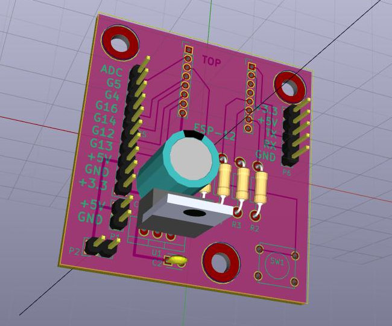

BasicESP Hardware Revision 2.0
==============================

Introduction
------------

This PCB design is the second in the basicesp line.  The basicesp is designed
to use the ESP-12 module and has:

   * 2mm pads for the ESP wifi module (the board has overhang/clearance space
     for the module so that the antenna gets no interference from the board)
   * Built-in 5V->3.3V regulator
   * A programming switch
   * A serial header
   * All the various resistors needed for mode setting

A GPIO header on the left side has the following pinout (from the top):

   1. ADC
   2. GPIO5 (NodeMCU IO Index 1)
   3. GPIO4 (Index 2)
   4. GPIO16 (Index 0)
   5. GPIO14 (Index 5)
   6. GPIO12 (Index 6)
   7. GPIO13 (Index 7)
   8. +5V
   9. GND
   10. +3.3V

Notably an I2C display (like the Sainsmart LCD2004 controller) can be wired
straight to pins 3-6 without any gymnastics.  A typical PIR motion sensor
module can be wired to pins 4-6 with minimal gymnastics (swapping the OUT and
either VCC or GND connection to match ends).

Production and Files
--------------------

This board was sent to manufacture on 6 Feb 2017.

The design was done using kicad for both schematic, netlist, and PCB layout.
The kicad source files are all in [kicad/](kicad/).

When assembled, the board should look like this:

And here is a [PDF of the schematic](schematic.pdf).

Shortcomings
------------

A 1.5-week wait from China :-)
